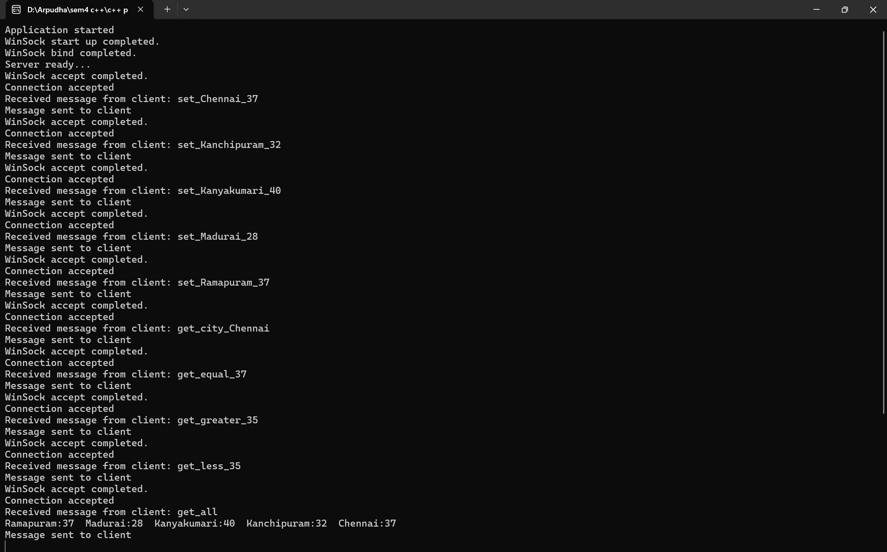
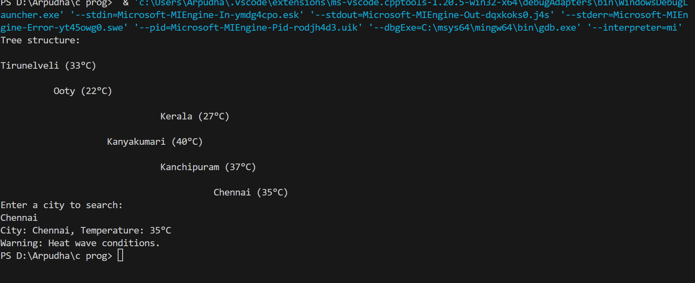

# Weather Searching using API and splay tree rotation
## Use Case
Implemented this using splay trees to perform insertion and searching the temperature based on city. Winsocket32 is used to establish the connection between the client and the server. The client is the frontend part of the application that users interact with. The primary functions of the client side: Data Request, Data Display, User Interaction. The server is the backend part of the application that handles data storage, processing and business logic. The functions of the server side include: Data Processing, User Management and Preferences, Scalability and Performance.

## Prerequisite
C++ - Splay tree insertion and rotation\
Winsocket32 - Establishes communication between client and the server

## Front End
Communication takes place between the client and the server.\

Splay tree insertion and searching is done along with warning display.\

